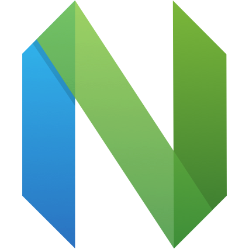
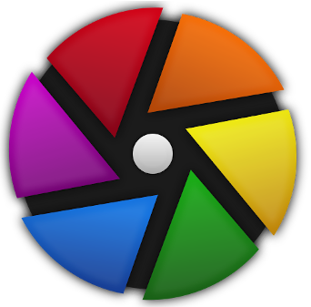

# 📚 Awesome Softwares

🔗 [中文版本](README.zh.md) | [English Version](README.md)

> A curated list of awesome software tools with their websites, platforms, descriptions, open source status, GitHub links, features, and tags.

> 📅 Last Updated: 2026-01-20

## 📖 Table of Contents

- [📚 Awesome Softwares](#-awesome-softwares)
  - [📖 Table of Contents](#-table-of-contents)
  - [Overview](#overview)
    - [💰 Cost](#-cost)
  - [Software List](#software-list)
  - [🎥 Multimedia & AV](#multimedia-&-av)
  - [📁 File Management & Transfer](#file-management-&-transfer)
  - [🌐 Internet & Browsers](#internet-&-browsers)
  - [⚙️ System Utilities & Optimization](#system-utilities-&-optimization)
  - [💻 Development & Programming](#development-&-programming)
  - [⚡ Productivity & Office](#productivity-&-office)
  - [📝 Notes & Knowledge](#notes-&-knowledge)
  - [🎨 Design & Image Editing](#design-&-image-editing)
  - [🖥️ Remote & Communication](#remote-&-communication)
  - [🎮 Fun & Entertainment](#fun-&-entertainment)
  - [🤖 AI & Machine Learning](#ai-&-machine-learning)
  - [🔒 Security & Privacy](#security-&-privacy)
  - [☁️ Cloud & Infrastructure](#cloud-&-infrastructure)

## Overview

### 💰 Cost

| Category | Description | Badge |
|----------|-------------|-------|
| 🟢 **Free** | All features are open, no registration or payment required. |  |
| 🟠 **Freemium** | Free basic version, premium features require subscription. |  |
| 🔴 **Paid** | All features require payment. |  |

## Software List

1. [Alfred](#alfred)
2. [Audacity](#audacity)
3. [Better Shot](#better-shot)
4. [BongoCat](#bongocat)
5. [Calibre](#calibre)
6. [Chatbox](#chatbox)
7. [Cherry Studio](#cherry-studio)
8. [Chrome](#chrome)
9. [Clash Verge Rev](#clash-verge-rev)
10. [CodeEdit](#codeedit)
11. [Darktable](#darktable)
12. [DynamicLake-Pro](#dynamiclake-pro)
13. [File-Converter](#file-converter)
14. [FlameShot](#flameshot)
15. [Ice](#ice)
16. [IINA](#iina)
17. [ImageOptim](#imageoptim)
18. [iTerm2](#iterm2)
19. [Joplin](#joplin)
20. [Karing](#karing)
21. [Keka](#keka)
22. [KOReader](#koreader)
23. [LocalSend](#localsend)
24. [Logseq](#logseq)
25. [MarkText](#marktext)
26. [Marp](#marp)
27. [Modern-CSV](#modern-csv)
28. [Motrix](#motrix)
29. [mpv](#mpv)
30. [Neovim](#neovim)
31. [OBS](#obs)
32. [Popcorn-Time](#popcorn-time)
33. [QuickRecorder](#quickrecorder)
34. [RunCat365](#runcat365)
35. [RustDesk](#rustdesk)
36. [ShareX](#sharex)
37. [Snippai](#snippai)
38. [Stats](#stats)
39. [Sublime-Text](#sublime-text)
40. [Transnomino](#transnomino)
41. [Typora](#typora)
42. [Ulauncher](#ulauncher)
43. [Utools](#utools)
44. [Zettlr](#zettlr)

## 🎥 Multimedia & AV

## IINA

| Item | Details |
| :------------------ | :----------------------------------------------------------------------------------------------------------------------------------------- |
| **🖼 Logo** |  |
| **🌐 Website** | [Visit](https://www.iina.io/) |
| **🖥 Platforms** |  |
| **🛠 Description** | A modern video player for macOS |
| **🔓 Open Source** |  |
| **📦 GitHub Repository** | [GitHub Link](https://github.com/iina/iina) |
| **⭐ GitHub Stars** |  |
| **💰 Cost** |  |
| **✨ Highlights** | - Free and open source - Excellent playback performance based on mpv - Native macOS design with system-standard interaction |
| **🏷 Tags** | #Player #macOS #Development

## Popcorn-Time

| Item | Details |
| :------------------ | :----------------------------------------------------------------------------------------------------------------------------------------- |
| **🖼 Logo** |  |
| **🌐 Website** | [Visit](https://popcorntime.app/) |
| **🖥 Platforms** |    |
| **🛠 Description** | Watch movies and TV shows with a vast content library |
| **🔓 Open Source** |  |
| **📦 GitHub Repository** | [GitHub Link](https://github.com/popcorntime/popcorntime) |
| **⭐ GitHub Stars** |  |
| **💰 Cost** |  |
| **✨ Highlights** | - Cross-platform - Beautiful interface - Massive content library - Recommendations - Offline viewing - Subtitle and multilingual support |
| **🏷 Tags** | #Player #Cross-platform #Freeware #Open Source

## mpv

| Item | Details |
| :------------------ | :----------------------------------------------------------------------------------------------------------------------------------------- |
| **🖼 Logo** |  |
| **🌐 Website** | [Visit](https://mpv.io/) |
| **🖥 Platforms** |    |
| **🛠 Description** | A free, open-source, cross-platform command-line media player. Supports most common media formats and subtitles, offers advanced video output and powerful scripting extensibility. |
| **🔓 Open Source** |  |
| **📦 GitHub Repository** | [GitHub Link](https://github.com/mpv-player/mpv) |
| **⭐ GitHub Stars** |  |
| **💰 Cost** |  |
| **✨ Highlights** | - Free and open source, lightweight and performant - Supports virtually all common video, audio, and subtitle formats - High quality OpenGL/Vulkan/D3D11 video rendering (color management, HDR, frame interpolation, scaling) - Hardware decoding support, low latency, excellent picture quality - Powerful scripting and embeddable C API - Tiny and cross-platform (Windows, macOS, Linux) |
| **🏷 Tags** | #Player #Cross-platform #Open Source #Command-line #Advanced Video Output #Hardware Decoding

## OBS

| Item | Details |
| :------------------ | :----------------------------------------------------------------------------------------------------------------------------------------- |
| **🖼 Logo** |  |
| **🌐 Website** | [Visit](https://obsproject.com/) |
| **🖥 Platforms** |    |
| **🛠 Description** | Free open source video recording and streaming software |
| **🔓 Open Source** |  |
| **📦 GitHub Repository** | [GitHub Link](https://github.com/obsproject/obs-studio) |
| **⭐ GitHub Stars** |  |
| **💰 Cost** |  |
| **✨ Highlights** | - High-performance real-time video/audio capture and mixing - Unlimited scene switching - Intuitive audio mixer - Powerful yet easy-to-use configuration - Modular dock interface |
| **🏷 Tags** | #Media Processing #Streaming #Cross-platform #Development

## QuickRecorder

| Item | Details |
| :------------------ | :----------------------------------------------------------------------------------------------------------------------------------------- |
| **🖼 Logo** |  |
| **🌐 Website** | [Visit](https://lihaoyun6.github.io/quickrecorder/) |
| **🖥 Platforms** |  |
| **🛠 Description** | Lightweight high-performance macOS screen recorder |
| **🔓 Open Source** |  |
| **📦 GitHub Repository** | [GitHub Link](https://github.com/lihaoyun6/QuickRecorder) |
| **⭐ GitHub Stars** |  |
| **💰 Cost** |  |
| **✨ Highlights** | - Screen, window, app and mobile device recording - Audio capture, mouse highlight, screen magnifier - Full macOS 14 Speaker前置 support - HEVC with Alpha video format support - Under 10MB in size |
| **🏷 Tags** | #Media Processing #macOS

## Audacity

| Item | Details |
| :------------------ | :----------------------------------------------------------------------------------------------------------------------------------------- |
| **🖼 Logo** |  |
| **🌐 Website** | [Visit](https://www.audacityteam.org/) |
| **🖥 Platforms** |    |
| **🛠 Description** | Free, open source, cross-platform audio editor for recording and editing |
| **🔓 Open Source** |  |
| **📦 GitHub Repository** | [GitHub Link](https://github.com/audacity/audacity) |
| **⭐ GitHub Stars** |  |
| **💰 Cost** |  |
| **✨ Highlights** | - Multi-track audio editing and recording - Import/export multiple audio formats - Rich effects and plugin support - Spectrogram view and audio analysis - Free and open source, cross-platform |
| **🏷 Tags** | #Audio Editing #Recording #Cross-platform #Open Source #Mixing

## 📁 File Management & Transfer

## LocalSend

| Item | Details |
| :------------------ | :----------------------------------------------------------------------------------------------------------------------------------------- |
| **🖼 Logo** |  |
| **🌐 Website** | [Visit](https://localsend.org/) |
| **🖥 Platforms** |       |
| **🛠 Description** | Cross-platform tool for quick file sharing within local network |
| **🔓 Open Source** |  |
| **📦 GitHub Repository** | [GitHub Link](https://github.com/localsend/localsend) |
| **⭐ GitHub Stars** |  |
| **💰 Cost** |  |
| **✨ Highlights** | - Decentralized, direct local transfer - Truly cross-platform covering desktop and mobile - Free and open source, privacy-friendly - Local network transfer, no external servers |
| **🏷 Tags** | #File Transfer #Cross-platform #Freeware #Open Source

## Motrix

| Item | Details |
| :------------------ | :----------------------------------------------------------------------------------------------------------------------------------------- |
| **🖼 Logo** |  |
| **🌐 Website** | [Visit](https://motrix.app/) |
| **🖥 Platforms** |    |
| **🛠 Description** | Open source download manager supporting HTTP, BT, magnet links and more protocols |
| **🔓 Open Source** |  |
| **📦 GitHub Repository** | [GitHub Link](https://github.com/agalwood/Motrix) |
| **⭐ GitHub Stars** |  |
| **💰 Cost** |  |
| **✨ Highlights** | - Multi-protocol support: HTTP, HTTPS, FTP, BT, magnet links - Multi-threaded downloads for speed - User-friendly interface with drag-and-drop and batch downloads - Open source and ad-free - Cross-platform compatibility |
| **🏷 Tags** | #Download Manager #BT #Magnet Links #Cross-platform #Open Source

## Keka

| Item | Details |
| :------------------ | :----------------------------------------------------------------------------------------------------------------------------------------- |
| **🖼 Logo** |  |
| **🌐 Website** | [Visit](https://www.keka.io/) |
| **🖥 Platforms** |   |
| **🛠 Description** | File compression and decompression tool |
| **🔓 Open Source** |  |
| **📦 GitHub Repository** | [GitHub Link](https://github.com/aonez/Keka) |
| **⭐ GitHub Stars** |  |
| **💰 Cost** |  |
| **✨ Highlights** | - Minimalist interface with powerful features - Privacy-focused with local data security - Focused on compression without bloat |
| **🏷 Tags** | #File Management #Compression #macOS #iOS

## Transnomino

| Item | Details |
| :------------------ | :----------------------------------------------------------------------------------------------------------------------------------------- |
| **🖼 Logo** |  |
| **🌐 Website** | [Visit](https://www.transnomino.com/) |
| **🖥 Platforms** |  |
| **🛠 Description** | Batch file rename tool for Mac |
| **🔓 Open Source** |  |
| **📦 GitHub Repository** | N/A |
| **⭐ GitHub Stars** | N/A |
| **💰 Cost** |  |
| **✨ Highlights** | - Simple text replacement - Advanced regex modification - Text insertion based on file attributes |
| **🏷 Tags** | #File Management #macOS #Development

## File-Converter

| Item | Details |
| :------------------ | :----------------------------------------------------------------------------------------------------------------------------------------- |
| **🖼 Logo** |  |
| **🌐 Website** | [Visit](https://file-converter.io/) |
| **🖥 Platforms** |  |
| **🛠 Description** | Simple file converter and compressor, accessible via Windows Explorer context menu |
| **🔓 Open Source** |  |
| **📦 GitHub Repository** | [GitHub Link](https://github.com/Tichau/FileConverter) |
| **⭐ GitHub Stars** |  |
| **💰 Cost** |  |
| **✨ Highlights** | - Simple and easy to use, just two clicks - Open source, free, no ads, no data collection - Supports multiple file format conversions - Video, audio, image, and document conversion - Customizable conversion presets - Available in 11 languages |
| **🏷 Tags** | #File Management #Windows #Open Source #Freeware

## Calibre

| Item | Details |
| :------------------ | :----------------------------------------------------------------------------------------------------------------------------------------- |
| **🖼 Logo** |  |
| **🌐 Website** | [Visit](https://calibre-ebook.com/) |
| **🖥 Platforms** |    |
| **🛠 Description** | The official source code repository for the calibre ebook manager |
| **🔓 Open Source** |  |
| **📦 GitHub Repository** | [GitHub Link](https://github.com/kovidgoyal/calibre) |
| **⭐ GitHub Stars** |  |
| **💰 Cost** |  |
| **✨ Highlights** | - E-book management - Format conversion - Reader - Library management |
| **🏷 Tags** | #E-book #Windows #macOS #Linux #OpenSource #Free

## KOReader

| Item | Details |
| :------------------ | :----------------------------------------------------------------------------------------------------------------------------------------- |
| **🖼 Logo** |  |
| **🌐 Website** | [Visit](https://koreader.rocks/) |
| **🖥 Platforms** |      |
| **🛠 Description** | An open source ebook reader with support for many formats, focused on reading experience |
| **🔓 Open Source** |  |
| **📦 GitHub Repository** | [GitHub Link](https://github.com/koreader/koreader) |
| **⭐ GitHub Stars** |  |
| **💰 Cost** |  |
| **✨ Highlights** | - Supports many ebook formats - Free and open source - Cross-platform compatibility - Focused on reading experience |
| **🏷 Tags** | #Ebook #Reader #Open Source #Cross-platform

## 🌐 Internet & Browsers

## Chrome

| Item | Details |
| :------------------ | :----------------------------------------------------------------------------------------------------------------------------------------- |
| **🖼 Logo** |  |
| **🌐 Website** | [Visit](https://www.google.com/chrome) |
| **🖥 Platforms** |      |
| **🛠 Description** | Google Chrome - The browser built for you |
| **🔓 Open Source** |  |
| **📦 GitHub Repository** | N/A |
| **⭐ GitHub Stars** | N/A |
| **💰 Cost** |  |
| **✨ Highlights** | - Customize for a personalized experience - Safe and secure web browsing - Fast way to get things done online |
| **🏷 Tags** | #Browser #Cross-platform #Freeware

## Karing

| Item | Details |
| :------------------ | :----------------------------------------------------------------------------------------------------------------------------------------- |
| **🖼 Logo** |  |
| **🌐 Website** | [Visit](https://karing.app/) |
| **🖥 Platforms** |      |
| **🛠 Description** | Simple & Powerful proxy utility, Support routing rules for clash/sing-box |
| **🔓 Open Source** |  |
| **📦 GitHub Repository** | [GitHub Link](https://github.com/KaringX/karing) |
| **⭐ GitHub Stars** |  |
| **💰 Cost** |  |
| **✨ Highlights** | - Supports Clash/Sing-box - Multi-subscription management - Custom routing rules - Cross-device sync - Flutter-based |
| **🏷 Tags** | #Proxy Utility #Network Tool #Cross-platform #Open Source #Routing Rules

## Clash Verge Rev

| Item | Details |
| :------------------ | :----------------------------------------------------------------------------------------------------------------------------------------- |
| **🖼 Logo** |  |
| **🌐 Website** | [Visit](https://www.clashverge.dev/) |
| **🖥 Platforms** |    |
| **🛠 Description** | A modern GUI client based on Tauri, designed to run in Windows, macOS and Linux for tailored proxy experience |
| **🔓 Open Source** |  |
| **📦 GitHub Repository** | [GitHub Link](https://github.com/clash-verge-rev/clash-verge-rev) |
| **⭐ GitHub Stars** |  |
| **💰 Cost** |  |
| **✨ Highlights** | - Supports Clash/Mihomo - Modern GUI interface - Tauri framework - Multi-platform support - Tailored proxy experience |
| **🏷 Tags** | #Proxy Tool #Clash #GUI Client #Open Source #Cross-platform

## ⚙️ System Utilities & Optimization

## Ice

| Item | Details |
| :------------------ | :----------------------------------------------------------------------------------------------------------------------------------------- |
| **🖼 Logo** |  |
| **🌐 Website** | [Visit](https://icemenubar.app/) |
| **🖥 Platforms** |  |
| **🛠 Description** | macOS menu bar management tool |
| **🔓 Open Source** |  |
| **📦 GitHub Repository** | [GitHub Link](https://github.com/jordanbaird/Ice) |
| **⭐ GitHub Stars** |  |
| **💰 Cost** |  |
| **✨ Highlights** | - Show hidden menu bar items below the bar - Drag-and-drop menu bar arrangement - Customizable menu bar appearance - Menu bar item search - Customizable menu bar item spacing |
| **🏷 Tags** | #System Tools #macOS

## Stats

| Item | Details |
| :------------------ | :----------------------------------------------------------------------------------------------------------------------------------------- |
| **🖼 Logo** |  |
| **🌐 Website** | [Visit](https://mac-stats.com/) |
| **🖥 Platforms** |  |
| **🛠 Description** | macOS system monitor in menu bar |
| **🔓 Open Source** |  |
| **📦 GitHub Repository** | [GitHub Link](https://github.com/exelban/stats) |
| **⭐ GitHub Stars** |  |
| **💰 Cost** |  |
| **✨ Highlights** | - CPU usage - GPU usage - Memory usage - Disk usage - Network usage - Battery level - Sensor information |
| **🏷 Tags** | #System Tools #macOS

## DynamicLake-Pro

| Item | Details |
| :------------------ | :----------------------------------------------------------------------------------------------------------------------------------------- |
| **🖼 Logo** |  |
| **🌐 Website** | [Visit](https://www.dynamiclake.com/) |
| **🖥 Platforms** |  |
| **🛠 Description** | macOS notch beautification and enhancement tool |
| **🔓 Open Source** |  |
| **📦 GitHub Repository** | N/A |
| **⭐ GitHub Stars** | N/A |
| **💰 Cost** |  |
| **✨ Highlights** | - miniLake - compact key information display - Significant UX improvement through detailed changes |
| **🏷 Tags** | #Design Tools #macOS

## Ulauncher

| Item | Details |
| :------------------ | :----------------------------------------------------------------------------------------------------------------------------------------- |
| **🖼 Logo** |  |
| **🌐 Website** | [Visit](https://ulauncher.io/) |
| **🖥 Platforms** |  |
| **🛠 Description** | Feature rich application Launcher for Linux |
| **🔓 Open Source** |  |
| **📦 GitHub Repository** | [GitHub Link](https://github.com/Ulauncher/Ulauncher) |
| **⭐ GitHub Stars** |  |
| **💰 Cost** |  |
| **✨ Highlights** | - Fuzzy search - Custom color themes - Shortcuts & extensions - Fast directory browser |
| **🏷 Tags** | #Launcher #Linux #OpenSource #Free

## 💻 Development & Programming

## Sublime-Text

| Item | Details |
| :------------------ | :----------------------------------------------------------------------------------------------------------------------------------------- |
| **🖼 Logo** |  |
| **🌐 Website** | [Visit](https://www.sublimetext.com/) |
| **🖥 Platforms** |    |
| **🛠 Description** | Text editor with syntax highlighting and smart auto-completion |
| **🔓 Open Source** |  |
| **📦 GitHub Repository** | N/A |
| **⭐ GitHub Stars** | N/A |
| **💰 Cost** |  |
| **✨ Highlights** | - GPU-accelerated rendering - Apple Silicon and Linux ARM64 support - Multiple selection with tabs - Smart context-aware auto-completion - New modern UI design - TypeScript, JSX and TSX support |
| **🏷 Tags** | #Development #Text Editor #Cross-platform

## iTerm2

| Item | Details |
| :------------------ | :----------------------------------------------------------------------------------------------------------------------------------------- |
| **🖼 Logo** |  |
| **🌐 Website** | [Visit](https://iterm2.com/) |
| **🖥 Platforms** |  |
| **🛠 Description** | macOS terminal with multi-tab and split pane support |
| **🔓 Open Source** |  |
| **📦 GitHub Repository** | [GitHub Link](https://github.com/gnachman/iTerm2) |
| **⭐ GitHub Stars** |  |
| **💰 Cost** |  |
| **✨ Highlights** | - Split panes - Hotkey window - Built-in search - Auto-completion - Copy mode - Highly customizable |
| **🏷 Tags** | #Development #Terminal #macOS #Productivity

## Typora

| Item | Details |
| :------------------ | :----------------------------------------------------------------------------------------------------------------------------------------- |
| **🖼 Logo** |  |
| **🌐 Website** | [Visit](https://typoraio.cn/) |
| **🖥 Platforms** |    |
| **🛠 Description** | Clean Markdown editor and reader with live preview |
| **🔓 Open Source** |  |
| **📦 GitHub Repository** | N/A |
| **⭐ GitHub Stars** | N/A |
| **💰 Cost** |  |
| **✨ Highlights** | - Read and write with live preview - Simple yet powerful - Highly accessible - Custom theme support |
| **🏷 Tags** | #Markdown #Cross-platform

## Neovim

| Item | Details |
| :------------------ | :----------------------------------------------------------------------------------------------------------------------------------------- |
| **🖼 Logo** |  |
| **🌐 Website** | [Visit](https://neovim.io/) |
| **🖥 Platforms** |    |
| **🛠 Description** | hyperextensible Vim-based text editor |
| **🔓 Open Source** |  |
| **📦 GitHub Repository** | [GitHub Link](https://github.com/neovim/neovim) |
| **⭐ GitHub Stars** |  |
| **💰 Cost** |  |
| **✨ Highlights** | - Hyperextensible - Built-in LSP client - Vim-compatible - Modern terminal features - Lua plugin support |
| **🏷 Tags** | #Text Editor #Vim #Open Source #Cross-platform #Development

## CodeEdit

| Item | Details |
| :------------------ | :----------------------------------------------------------------------------------------------------------------------------------------- |
| **🖼 Logo** |  |
| **🌐 Website** | [Visit](https://www.codeedit.app/) |
| **🖥 Platforms** |  |
| **🛠 Description** | A native code editor for macOS, lightweight, high-performance, open source and free |
| **🔓 Open Source** |  |
| **📦 GitHub Repository** | [GitHub Link](https://github.com/CodeEditApp/CodeEdit) |
| **⭐ GitHub Stars** |  |
| **💰 Cost** |  |
| **✨ Highlights** | - Native macOS architecture - High performance - Community-driven - Extensible - Familiar interface |
| **🏷 Tags** | #Code Editor #macOS #Native App #Open Source #Swift

## ⚡ Productivity & Office

## Alfred

| Item | Details |
| :------------------ | :----------------------------------------------------------------------------------------------------------------------------------------- |
| **🖼 Logo** |  |
| **🌐 Website** | [Visit](https://www.alfredapp.com/) |
| **🖥 Platforms** |  |
| **🛠 Description** | macOS productivity app for search, shortcuts, and text expansion |
| **🔓 Open Source** |  |
| **📦 GitHub Repository** | N/A |
| **⭐ GitHub Stars** | N/A |
| **💰 Cost** |  |
| **✨ Highlights** | - Search and browse - Type less, say more - Extend and automate - Control your music - Highly customizable for efficiency |
| **🏷 Tags** | #Productivity #macOS

## Utools

| Item | Details |
| :------------------ | :----------------------------------------------------------------------------------------------------------------------------------------- |
| **🖼 Logo** |  |
| **🌐 Website** | [Visit](https://www.u-tools.cn) |
| **🖥 Platforms** |    |
| **🛠 Description** | AI-powered universal tool platform with plugins |
| **🔓 Open Source** |  |
| **📦 GitHub Repository** | N/A |
| **⭐ GitHub Stars** | N/A |
| **💰 Cost** |  |
| **✨ Highlights** | - Universal search bar - Powerful right-click menu - Plugin-based apps - Extensive plugin ecosystem |
| **🏷 Tags** | #Productivity #Cross-platform #AI

## Modern-CSV

| Item | Details |
| :------------------ | :----------------------------------------------------------------------------------------------------------------------------------------- |
| **🖼 Logo** |  |
| **🌐 Website** | [Visit](https://www.moderncsv.com/) |
| **🖥 Platforms** |    |
| **🛠 Description** | Intuitive CSV editor and viewer |
| **🔓 Open Source** |  |
| **📦 GitHub Repository** | N/A |
| **⭐ GitHub Stars** | N/A |
| **💰 Cost** |  |
| **✨ Highlights** | - Easy CSV file editing - Find and arrange CSV data - Cross-platform consistency - Privacy guaranteed - Fast viewing of large CSV files - Fully customizable CSV editor |
| **🏷 Tags** | #Data Analysis #CSV Editor #Cross-platform

## 📝 Notes & Knowledge

## Joplin

| Item | Details |
| :------------------ | :----------------------------------------------------------------------------------------------------------------------------------------- |
| **🖼 Logo** |  |
| **🌐 Website** | [Visit](https://joplinapp.org/) |
| **🖥 Platforms** |      |
| **🛠 Description** | Open source note-taking app with Markdown support, cross-platform sync, privacy-focused |
| **🔓 Open Source** |  |
| **📦 GitHub Repository** | [GitHub Link](https://github.com/laurent22/joplin) |
| **⭐ GitHub Stars** |  |
| **💰 Cost** |  |
| **✨ Highlights** | - Multimedia notes, math expressions, and diagrams - Cross-platform sync with E2EE encryption - Web clipper extension for saving web pages - Customizable with plugins and themes - Terminal app available - Open source, ensuring data ownership |
| **🏷 Tags** | #Markdown #Note-taking #Cross-platform #Open Source #Sync #Privacy

## Logseq

| Item | Details |
| :------------------ | :----------------------------------------------------------------------------------------------------------------------------------------- |
| **🖼 Logo** |  |
| **🌐 Website** | [Visit](https://logseq.com/) |
| **🖥 Platforms** |       |
| **🛠 Description** | Privacy-first, open-source knowledge base with Markdown and bi-directional links |
| **🔓 Open Source** |  |
| **📦 GitHub Repository** | [GitHub Link](https://github.com/logseq/logseq) |
| **⭐ GitHub Stars** |  |
| **💰 Cost** |  |
| **✨ Highlights** | - Local-first, privacy-focused - Markdown and bi-directional linking support - Powerful query and search capabilities - Plugin extensibility and custom themes - Cross-platform including web version - Open source, ensuring data ownership |
| **🏷 Tags** | #Markdown #Knowledge Management #Note-taking #Open Source #Privacy #Bi-directional Links

## MarkText

| Item | Details |
| :------------------ | :----------------------------------------------------------------------------------------------------------------------------------------- |
| **🖼 Logo** |  |
| **🌐 Website** | [Visit](https://www.marktext.me/) |
| **🖥 Platforms** |    |
| **🛠 Description** | Simple and elegant open-source Markdown editor with real-time preview |
| **🔓 Open Source** |  |
| **📦 GitHub Repository** | [GitHub Link](https://github.com/marktext/marktext) |
| **⭐ GitHub Stars** |  |
| **💰 Cost** |  |
| **✨ Highlights** | - Realtime preview and clean interface - Support CommonMark, GFM and Pandoc - Math expressions, front matter and emojis - Output HTML and PDF files - Various themes and editing modes - Paste images directly from clipboard |
| **🏷 Tags** | #Markdown #Editor #Real-time Preview

## Zettlr

| Item | Details |
| :------------------ | :----------------------------------------------------------------------------------------------------------------------------------------- |
| **🖼 Logo** |  |
| **🌐 Website** | [Visit](https://www.zettlr.com/) |
| **🖥 Platforms** |    |
| **🛠 Description** | A free and open-source Markdown editor designed for academic writing |
| **🔓 Open Source** |  |
| **📦 GitHub Repository** | [GitHub Link](https://github.com/Zettlr/Zettlr) |
| **⭐ GitHub Stars** |  |
| **💰 Cost** |  |
| **✨ Highlights** | - Citation management - Zettelkasten support - Multiple export formats - Privacy-first - Split-view |
| **🏷 Tags** | #Markdown #Academic Writing #Zettelkasten #Open Source #Cross-platform

## Marp

| Item | Details |
| :------------------ | :----------------------------------------------------------------------------------------------------------------------------------------- |
| **🖼 Logo** |  |
| **🌐 Website** | [Visit](https://marp.app/) |
| **🖥 Platforms** |    |
| **🛠 Description** | Markdown Presentation Ecosystem for creating beautiful slide decks |
| **🔓 Open Source** |  |
| **📦 GitHub Repository** | [GitHub Link](https://github.com/marp-team/marp) |
| **⭐ GitHub Stars** |  |
| **💰 Cost** |  |
| **✨ Highlights** | - Based on CommonMark - Built-in themes - Export to HTML/PDF/PPT - Directives and extended syntax - Pluggable architecture |
| **🏷 Tags** | #Markdown #Presentation #Slides #Open Source #Cross-platform

## 🎨 Design & Image Editing

## ImageOptim

| Item | Details |
| :------------------ | :----------------------------------------------------------------------------------------------------------------------------------------- |
| **🖼 Logo** |  |
| **🌐 Website** | [Visit](https://imageoptim.com/mac) |
| **🖥 Platforms** |  |
| **🛠 Description** | Lossless image compression tool |
| **🔓 Open Source** |  |
| **📦 GitHub Repository** | [GitHub Link](https://github.com/ImageOptim/ImageOptim) |
| **⭐ GitHub Stars** |  |
| **💰 Cost** |  |
| **✨ Highlights** | - Reduce image file size - Remove invisible junk - Completely free and open source |
| **🏷 Tags** | #Image Processing #macOS

## Snippai

| Item | Details |
| :------------------ | :----------------------------------------------------------------------------------------------------------------------------------------- |
| **🖼 Logo** |  |
| **🌐 Website** | [Visit](https://www.snippai.de/) |
| **🖥 Platforms** |    |
| **🛠 Description** | AI-powered smart screenshot tool |
| **🔓 Open Source** |  |
| **📦 GitHub Repository** | [GitHub Link](https://github.com/xyTom/snippai) |
| **⭐ GitHub Stars** |  |
| **💰 Cost** |  |
| **✨ Highlights** | - Formula recognition - Text extraction - Table conversion - Image analysis - Problem solving - Code understanding - Color extraction - Language translation |
| **🏷 Tags** | #Screenshot Tool #Cross-platform #AI #Freeware #Open Source

## Better Shot

| Item | Details |
| :------------------ | :----------------------------------------------------------------------------------------------------------------------------------------- |
| **🖼 Logo** |  |
| **🌐 Website** | [Visit](https://bettershot.site/) |
| **🖥 Platforms** |  |
| **🛠 Description** | Free and open-source macOS screenshot tool. Capture, edit, annotate, OCR, and export fast with privacy-first, native performance. |
| **🔓 Open Source** |  |
| **📦 GitHub Repository** | [GitHub Link](https://github.com/KartikLabhshetwar/better-shot) |
| **⭐ GitHub Stars** |  |
| **💰 Cost** |  |
| **✨ Highlights** | - Region/Window/Fullscreen capture with global shortcuts - Powerful editor: backgrounds, gradients, blur, shadows, border radius - Annotation tools: shapes, arrows, text, numbered labels - Offline OCR with bundled Tesseract.js language data - Privacy-first: all local, no uploads, no data collection - Native performance: Rust + Tauri, minimal resource usage - Fast export to directory or clipboard |
| **🏷 Tags** | #Screenshot Tool #macOS #Open Source #Freeware

## ShareX

| Item | Details |
| :------------------ | :----------------------------------------------------------------------------------------------------------------------------------------- |
| **🖼 Logo** |  |
| **🌐 Website** | [Visit](https://getsharex.com/) |
| **🖥 Platforms** |  |
| **🛠 Description** | ShareX is a free and open-source screen capture and file sharing tool |
| **🔓 Open Source** |  |
| **📦 GitHub Repository** | [GitHub Link](https://github.com/ShareX/ShareX) |
| **⭐ GitHub Stars** |  |
| **💰 Cost** |  |
| **✨ Highlights** | - Screen capture and recording - File upload to multiple destinations - OCR text recognition - GIF recording |
| **🏷 Tags** | #Screenshot #Windows #OpenSource #Free

## FlameShot

| Item | Details |
| :------------------ | :----------------------------------------------------------------------------------------------------------------------------------------- |
| **🖼 Logo** |  |
| **🌐 Website** | [Visit](https://flameshot.org/) |
| **🖥 Platforms** |    |
| **🛠 Description** | Powerful yet simple to use screenshot software |
| **🔓 Open Source** |  |
| **📦 GitHub Repository** | [GitHub Link](https://github.com/flameshot-org/flameshot) |
| **⭐ GitHub Stars** |  |
| **💰 Cost** |  |
| **✨ Highlights** | - Customizable appearance - In-app screenshot editing - DBus interface - Upload to Imgur |
| **🏷 Tags** | #Screenshot #Linux #Windows #macOS #OpenSource #Free

## Darktable

| Item | Details |
| :------------------ | :----------------------------------------------------------------------------------------------------------------------------------------- |
| **🖼 Logo** |  |
| **🌐 Website** | [Visit](https://www.darktable.org/) |
| **🖥 Platforms** |    |
| **🛠 Description** | Open source photography workflow application and raw developer, virtual lighttable and darkroom |
| **🔓 Open Source** |  |
| **📦 GitHub Repository** | [GitHub Link](https://github.com/darktable-org/darktable) |
| **⭐ GitHub Stars** |  |
| **💰 Cost** |  |
| **✨ Highlights** | - Non-destructive editing - Professional color management - GPU acceleration - Database management - Community-driven |
| **🏷 Tags** | #Photography #RAW Processing #Image Editing #Open Source #Cross-platform

## 🖥️ Remote & Communication

## RustDesk

| Item | Details |
| :------------------ | :----------------------------------------------------------------------------------------------------------------------------------------- |
| **🖼 Logo** |  |
| **🌐 Website** | [Visit](https://rustdesk.com/) |
| **🖥 Platforms** |      |
| **🛠 Description** | Open source remote desktop software with self-hosted server, privacy-focused |
| **🔓 Open Source** |  |
| **📦 GitHub Repository** | [GitHub Link](https://github.com/rustdesk/rustdesk) |
| **⭐ GitHub Stars** |  |
| **💰 Cost** |  |
| **✨ Highlights** | - Self-hosted server, no third-party dependency - End-to-end encryption for privacy - No configuration required, works out of box - File transfer and chat support - Cross-platform compatibility |
| **🏷 Tags** | #Remote Desktop #Cross-platform #Open Source #Privacy #Self-hosted

## 🎮 Fun & Entertainment

## BongoCat

| Item | Details |
| :------------------ | :----------------------------------------------------------------------------------------------------------------------------------------- |
| **🖼 Logo** |  |
| **🌐 Website** | [Visit](https://github.com/ayangweb/BongoCat) |
| **🖥 Platforms** |    |
| **🛠 Description** | Cross-platform desktop pet for fun |
| **🔓 Open Source** |  |
| **📦 GitHub Repository** | [GitHub Link](https://github.com/ayangweb/BongoCat) |
| **⭐ GitHub Stars** |  |
| **💰 Cost** |  |
| **✨ Highlights** | - macOS, Windows and Linux(x11) support - Syncs with keyboard/mouse actions - Completely open source, no data collection - Works offline |
| **🏷 Tags** | #Fun Tools #Cross-platform #Open Source

## RunCat365

| Item | Details |
| :------------------ | :----------------------------------------------------------------------------------------------------------------------------------------- |
| **🖼 Logo** |  |
| **🌐 Website** | [Visit](https://kyome22.github.io/RunCat365/) |
| **🖥 Platforms** |  |
| **🛠 Description** | Running cat animation on Windows taskbar showing CPU usage |
| **🔓 Open Source** |  |
| **📦 GitHub Repository** | [GitHub Link](https://github.com/Kyome22/RunCat365) |
| **⭐ GitHub Stars** |  |
| **💰 Cost** |  |
| **✨ Highlights** | - Cute animation - Visual CPU usage indicator |
| **🏷 Tags** | #Fun Tools #Windows

## 🤖 AI & Machine Learning

## Cherry Studio

| Item | Details |
| :------------------ | :----------------------------------------------------------------------------------------------------------------------------------------- |
| **🖼 Logo** |  |
| **🌐 Website** | [Visit](https://www.cherry-ai.com/) |
| **🖥 Platforms** |    |
| **🛠 Description** | AI desktop client supporting multiple models, with 300+ AI assistants, autonomous coding, and intelligent automation |
| **🔓 Open Source** |  |
| **📦 GitHub Repository** | [GitHub Link](https://github.com/CherryHQ/cherry-studio) |
| **⭐ GitHub Stars** |  |
| **💰 Cost** |  |
| **✨ Highlights** | - Supports 50+ LLM providers - 300+ pre-configured assistants - Multi-model conversations - Document processing - Knowledge base management |
| **🏷 Tags** | #AI Assistant #Multi-model #Desktop Client #Open Source #Cross-platform

## Chatbox

| Item | Details |
| :------------------ | :----------------------------------------------------------------------------------------------------------------------------------------- |
| **🖼 Logo** |  |
| **🌐 Website** | [Visit](https://chatboxai.app/) |
| **🖥 Platforms** |       |
| **🛠 Description** | Powerful AI client compatible with many cutting-edge AI models and APIs |
| **🔓 Open Source** |  |
| **📦 GitHub Repository** | [GitHub Link](https://github.com/chatboxai/chatbox) |
| **⭐ GitHub Stars** |  |
| **💰 Cost** |  |
| **✨ Highlights** | - Chat with documents & images - Code generation & preview - Real-time web search - Data visualization - Multi-platform support |
| **🏷 Tags** | #AI Client #Multi-model #Chat Assistant #Open Source #Cross-platform

## 🔒 Security & Privacy

## ☁️ Cloud & Infrastructure

