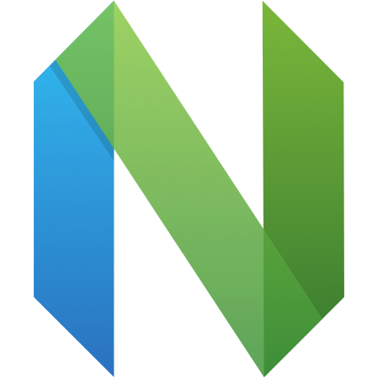
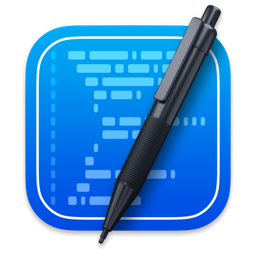
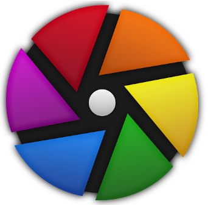

# 📚 软件列表

🔗 [中文版本](README.zh.md) | [English Version](README.md)

> 本仓库整理并收录常用软件的信息，包括官网地址、支持平台、主要用途、开源与否、GitHub 仓库链接、功能亮点及分类标签等，旨在作为一个清晰、可查阅的软件清单索引。

> 📅 最后更新: 2026-03-08

## 📖 目录

- [📚 软件列表](#-软件列表)
  - [📖 目录](#-目录)
  - [说明](#说明)
    - [💰 是否免费](#-是否免费)
  - [软件列表](#软件列表)
  - [🎥 多媒体与音视频](#多媒体与音视频)
  - [📁 文件管理与传输](#文件管理与传输)
  - [🌐 网络工具与浏览器](#网络工具与浏览器)
  - [⚙️ 系统工具与优化](#系统工具与优化)
  - [💻 开发与编程](#开发与编程)
  - [⚡ 办公与生产力](#办公与生产力)
  - [📝 笔记、知识与写作管理](#笔记、知识与写作管理)
  - [🎨 设计与图像处理](#设计与图像处理)
  - [🖥️ 远程协作与通讯](#远程协作与通讯)
  - [🎮 娱乐与趣味](#娱乐与趣味)
  - [🤖 人工智能与机器学习](#人工智能与机器学习)
  - [🔒 安全与隐私](#安全与隐私)
  - [☁️ 云计算与基础设施](#云计算与基础设施)

## 说明

### 💰 是否免费

| 类别                           | 描述                                                 | 徽章                                                           |
| ------------------------------ | ---------------------------------------------------- | -------------------------------------------------------------- |
| 🟢 **完全免费（Free）**         | 所有功能开放，无需注册或付费即可使用全部功能。       |     |
| 🟠 **部分功能付费（Freemium）** | 提供基本功能的免费版本，高级功能需订阅或一次性付费。 |  |
| 🔴 **完全付费（Paid）** | 所有功能需付费使用。                                 |  |

## 软件列表

1. [Alfred](#alfred)
2. [Animeko](#animeko)
3. [Applite](#applite)
4. [Audacity](#audacity)
5. [Better Shot](#better-shot)
6. [BongoCat](#bongocat)
7. [Boring Notch](#boring-notch)
8. [Calibre](#calibre)
9. [Chatbox](#chatbox)
10. [ChatMCP](#chatmcp)
11. [Cherry Studio](#cherry-studio)
12. [Chrome](#chrome)
13. [Clash Nyanpasu](#clash-nyanpasu)
14. [Clash Verge Rev](#clash-verge-rev)
15. [CodeEdit](#codeedit)
16. [Darktable](#darktable)
17. [DynamicLake-Pro](#dynamiclake-pro)
18. [Easydict](#easydict)
19. [File-Converter](#file-converter)
20. [FlameShot](#flameshot)
21. [HandBrake](#handbrake)
22. [Ice](#ice)
23. [IINA](#iina)
24. [ImageOptim](#imageoptim)
25. [iTerm2](#iterm2)
26. [Joplin](#joplin)
27. [Karing](#karing)
28. [Keka](#keka)
29. [KOReader](#koreader)
30. [Launchy](#launchy)
31. [LocalSend](#localsend)
32. [Logseq](#logseq)
33. [Mac Mouse Fix](#mac-mouse-fix)
34. [MarkText](#marktext)
35. [Marp](#marp)
36. [Modern-CSV](#modern-csv)
37. [Motrix](#motrix)
38. [mpv](#mpv)
39. [Neovim](#neovim)
40. [OBS](#obs)
41. [Onlook](#onlook)
42. [PicGo](#picgo)
43. [Popcorn-Time](#popcorn-time)
44. [QuickRecorder](#quickrecorder)
45. [RunCat365](#runcat365)
46. [RustDesk](#rustdesk)
47. [ShareX](#sharex)
48. [Snippai](#snippai)
49. [Stats](#stats)
50. [Sublime-Text](#sublime-text)
51. [Transnomino](#transnomino)
52. [Typora](#typora)
53. [Ulauncher](#ulauncher)
54. [uPic](#upic)
55. [Utools](#utools)
56. [VidBee](#vidbee)
57. [Zen Browser](#zen-browser)
58. [Zettlr](#zettlr)

## 🎥 多媒体与音视频

## IINA

| 信息项 | 详情 |
| :------------------ | :----------------------------------------------------------------------------------------------------------------------------------------- |
| **🖼 Logo** |  |
| **🌐 官网** | [点击访问](https://www.iina.io/) |
| **🖥 适用系统** |  |
| **🛠 功能用途** | 面向 macOS 的现代化视频播放器 |
| **🔓 是否开源** |  |
| **📦 GitHub 源代码** | [GitHub Link](https://github.com/iina/iina) |
| **⭐ GitHub Stars** |  |
| **💰 是否免费** |  |
| **✨ 亮点** | - 免费且开源 - 基于 mpv 内核，播放性能出色 - 原生 macOS 设计，符合系统交互习惯 |
| **🏷 分类** | #播放器 #macOS #开发工具

## Popcorn-Time

| 信息项 | 详情 |
| :------------------ | :----------------------------------------------------------------------------------------------------------------------------------------- |
| **🖼 Logo** |  |
| **🌐 官网** | [点击访问](https://popcorntime.app/) |
| **🖥 适用系统** |    |
| **🛠 功能用途** | 观看电影、电视剧等，汇聚海量内容 |
| **🔓 是否开源** |  |
| **📦 GitHub 源代码** | [GitHub Link](https://github.com/popcorntime/popcorntime) |
| **⭐ GitHub Stars** |  |
| **💰 是否免费** |  |
| **✨ 亮点** | - 跨平台 - 美观界面 - 海量内容库 - 推荐功能 - 离线观看 - 支持字幕与多语言 |
| **🏷 分类** | #播放器 #跨平台 #免费软件 #开源软件

## mpv

| 信息项 | 详情 |
| :------------------ | :----------------------------------------------------------------------------------------------------------------------------------------- |
| **🖼 Logo** |  |
| **🌐 官网** | [点击访问](https://mpv.io/) |
| **🖥 适用系统** |    |
| **🛠 功能用途** | 自由、开源、跨平台的高性能命令行媒体播放器，支持几乎所有常见媒体格式和字幕类型，拥有高级视频输出与强大脚本扩展。 |
| **🔓 是否开源** |  |
| **📦 GitHub 源代码** | [GitHub Link](https://github.com/mpv-player/mpv) |
| **⭐ GitHub Stars** |  |
| **💰 是否免费** |  |
| **✨ 亮点** | - 免费开源，内核纯净、性能极致 - 几乎支持全部主流视频、音频与字幕格式 - 高级 OpenGL/Vulkan/D3D11 视频渲染，支持色彩管理/HDR/插帧/高质量缩放等 - 支持硬件解码、极低延迟、极佳画面 - 超强脚本能力和 C API 可嵌入其它应用 - 小巧精悍，跨三大桌面平台 |
| **🏷 分类** | #播放器 #跨平台 #开源软件 #命令行 #高级视频输出 #硬件解码

## OBS

| 信息项 | 详情 |
| :------------------ | :----------------------------------------------------------------------------------------------------------------------------------------- |
| **🖼 Logo** |  |
| **🌐 官网** | [点击访问](https://obsproject.com/) |
| **🖥 适用系统** |    |
| **🛠 功能用途** | 免费开源的视频录制和直播软件 |
| **🔓 是否开源** |  |
| **📦 GitHub 源代码** | [GitHub Link](https://github.com/obsproject/obs-studio) |
| **⭐ GitHub Stars** |  |
| **💰 是否免费** |  |
| **✨ 亮点** | - 高性能实时视频/音频捕获和混合 - 无限数量的场景切换 - 直观的音频混音器 - 功能强大且易于使用的配置选项 - 模块化 Dock 界面 |
| **🏷 分类** | #音视频处理 #直播 #跨平台 #开发工具

## QuickRecorder

| 信息项 | 详情 |
| :------------------ | :----------------------------------------------------------------------------------------------------------------------------------------- |
| **🖼 Logo** |  |
| **🌐 官网** | [点击访问](https://lihaoyun6.github.io/quickrecorder/) |
| **🖥 适用系统** |  |
| **🛠 功能用途** | 轻量化高性能 macOS 屏幕录制工具 |
| **🔓 是否开源** |  |
| **📦 GitHub 源代码** | [GitHub Link](https://github.com/lihaoyun6/QuickRecorder) |
| **⭐ GitHub Stars** |  |
| **💰 是否免费** |  |
| **✨ 亮点** | - 支持录制屏幕、窗口、应用和移动设备 - 无驱动音频回录、鼠标高亮、屏幕放大镜 - 完整支持 macOS 14 "演讲者前置" - 支持 HEVC with Alpha 视频格式 - 软件体积小于 10MB |
| **🏷 分类** | #音视频处理 #macOS

## Audacity

| 信息项 | 详情 |
| :------------------ | :----------------------------------------------------------------------------------------------------------------------------------------- |
| **🖼 Logo** |  |
| **🌐 官网** | [点击访问](https://www.audacityteam.org/) |
| **🖥 适用系统** |    |
| **🛠 功能用途** | 免费开源的音频编辑器，支持录音、编辑和混音 |
| **🔓 是否开源** |  |
| **📦 GitHub 源代码** | [GitHub Link](https://github.com/audacity/audacity) |
| **⭐ GitHub Stars** |  |
| **💰 是否免费** |  |
| **✨ 亮点** | - 多轨音频编辑和录音 - 支持多种音频格式导入导出 - 丰富的效果和插件支持 - 频谱分析和音频可视化 - 免费开源，跨平台 |
| **🏷 分类** | #音频编辑 #录音 #跨平台 #开源软件 #混音

## HandBrake

| 信息项 | 详情 |
| :------------------ | :----------------------------------------------------------------------------------------------------------------------------------------- |
| **🖼 Logo** |  |
| **🌐 官网** | [点击访问](https://handbrake.fr/) |
| **🖥 适用系统** |    |
| **🛠 功能用途** | 开源视频转码器，将视频从几乎任何格式转换为现代编解码器 |
| **🔓 是否开源** |  |
| **📦 GitHub 源代码** | [GitHub Link](https://github.com/HandBrake/HandBrake) |
| **⭐ GitHub Stars** |  |
| **💰 是否免费** |  |
| **✨ 亮点** | - 支持多种输入格式 - 现代编解码器输出 - 免费开源 - 多平台支持 - 社区驱动 |
| **🏷 分类** | #视频转码 #编解码器 #开源软件 #跨平台 #媒体处理

## VidBee

| 信息项 | 详情 |
| :------------------ | :----------------------------------------------------------------------------------------------------------------------------------------- |
| **🖼 Logo** |  |
| **🌐 官网** | [点击访问](https://vidbee.org/) |
| **🖥 适用系统** |    |
| **🛠 功能用途** | 开源视频下载器，支持YouTube、TikTok等1000+平台的高质量视频下载 |
| **🔓 是否开源** |  |
| **📦 GitHub 源代码** | [GitHub Link](https://github.com/nexmoe/VidBee) |
| **⭐ GitHub Stars** |  |
| **💰 是否免费** |  |
| **✨ 亮点** | - 支持1000+视频平台 - 高清4K/8K视频下载 - 批量队列和RSS自动下载 - 字幕提取和多语言支持 - 现代化界面设计 |
| **🏷 分类** | #视频下载 #下载器 #跨平台 #开源软件 #免费软件

## 📁 文件管理与传输

## LocalSend

| 信息项 | 详情 |
| :------------------ | :----------------------------------------------------------------------------------------------------------------------------------------- |
| **🖼 Logo** |  |
| **🌐 官网** | [点击访问](https://localsend.org/) |
| **🖥 适用系统** |       |
| **🛠 功能用途** | 局域网内快速分享文件的跨平台工具 |
| **🔓 是否开源** |  |
| **📦 GitHub 源代码** | [GitHub Link](https://github.com/localsend/localsend) |
| **⭐ GitHub Stars** |  |
| **💰 是否免费** |  |
| **✨ 亮点** | - 去中心化，本地直连传输 - 真正跨平台，覆盖桌面与移动设备 - 免费且开源，隐私友好 - 局域网传输，无需外部服务器 |
| **🏷 分类** | #文件传输 #跨平台 #免费软件 #开源软件

## Motrix

| 信息项 | 详情 |
| :------------------ | :----------------------------------------------------------------------------------------------------------------------------------------- |
| **🖼 Logo** |  |
| **🌐 官网** | [点击访问](https://motrix.app/) |
| **🖥 适用系统** |    |
| **🛠 功能用途** | 开源下载管理器，支持 HTTP、BT、磁力链接等多协议下载 |
| **🔓 是否开源** |  |
| **📦 GitHub 源代码** | [GitHub Link](https://github.com/agalwood/Motrix) |
| **⭐ GitHub Stars** |  |
| **💰 是否免费** |  |
| **✨ 亮点** | - 支持多协议下载：HTTP、HTTPS、FTP、BT、磁力链接 - 多线程下载，提升速度 - 界面友好，支持拖拽和批量下载 - 开源免费，无广告 - 跨平台兼容 |
| **🏷 分类** | #下载管理器 #BT #磁力链接 #跨平台 #开源软件

## Keka

| 信息项 | 详情 |
| :------------------ | :----------------------------------------------------------------------------------------------------------------------------------------- |
| **🖼 Logo** |  |
| **🌐 官网** | [点击访问](https://www.keka.io/) |
| **🖥 适用系统** |   |
| **🛠 功能用途** | 文件压缩与解压缩工具 |
| **🔓 是否开源** |  |
| **📦 GitHub 源代码** | [GitHub Link](https://github.com/aonez/Keka) |
| **⭐ GitHub Stars** |  |
| **💰 是否免费** |  |
| **✨ 亮点** | - 界面极简，但功能强大 - 注重隐私与本地数据安全 - 专注压缩本身，不引入多余功能 |
| **🏷 分类** | #文件管理 #压缩 #macOS #iOS

## Transnomino

| 信息项 | 详情 |
| :------------------ | :----------------------------------------------------------------------------------------------------------------------------------------- |
| **🖼 Logo** |  |
| **🌐 官网** | [点击访问](https://www.transnomino.com/) |
| **🖥 适用系统** |  |
| **🛠 功能用途** | Mac 批量重命名工具 |
| **🔓 是否开源** |  |
| **📦 GitHub 源代码** | N/A |
| **⭐ GitHub Stars** | N/A |
| **💰 是否免费** |  |
| **✨ 亮点** | - 简单文本替换 - 高级正则表达式修改 - 基于文件属性的文本插入 |
| **🏷 分类** | #文件管理 #macOS #开发工具

## File-Converter

| 信息项 | 详情 |
| :------------------ | :----------------------------------------------------------------------------------------------------------------------------------------- |
| **🖼 Logo** |  |
| **🌐 官网** | [点击访问](https://file-converter.io/) |
| **🖥 适用系统** |  |
| **🛠 功能用途** | 简单易用的文件转换和压缩工具，通过 Windows 资源管理器右键菜单使用 |
| **🔓 是否开源** |  |
| **📦 GitHub 源代码** | [GitHub Link](https://github.com/Tichau/FileConverter) |
| **⭐ GitHub Stars** |  |
| **💰 是否免费** |  |
| **✨ 亮点** | - 简单易用，只需点击两下 - 开源免费，无广告，不收集数据 - 支持多种文件格式转换 - 支持视频、音频、图片、文档转换 - 可自定义转换预设 - 支持 11 种语言 |
| **🏷 分类** | #文件管理 #Windows #开源软件 #免费软件

## Calibre

| 信息项 | 详情 |
| :------------------ | :----------------------------------------------------------------------------------------------------------------------------------------- |
| **🖼 Logo** |  |
| **🌐 官网** | [点击访问](https://calibre-ebook.com/) |
| **🖥 适用系统** |    |
| **🛠 功能用途** | 一款强大的电子书管理和转换工具 |
| **🔓 是否开源** |  |
| **📦 GitHub 源代码** | [GitHub Link](https://github.com/kovidgoyal/calibre) |
| **⭐ GitHub Stars** |  |
| **💰 是否免费** |  |
| **✨ 亮点** | - 电子书管理 - 格式转换 - 阅读器 - 库管理 |
| **🏷 分类** | #电子书 #Windows #macOS #Linux #开源软件 #免费软件

## KOReader

| 信息项 | 详情 |
| :------------------ | :----------------------------------------------------------------------------------------------------------------------------------------- |
| **🖼 Logo** |  |
| **🌐 官网** | [点击访问](https://koreader.rocks/) |
| **🖥 适用系统** |      |
| **🛠 功能用途** | 开源电子书阅读器，支持多种格式，专注阅读体验 |
| **🔓 是否开源** |  |
| **📦 GitHub 源代码** | [GitHub Link](https://github.com/koreader/koreader) |
| **⭐ GitHub Stars** |  |
| **💰 是否免费** |  |
| **✨ 亮点** | - 支持多种电子书格式 - 开源免费 - 跨平台兼容 - 专注阅读体验 |
| **🏷 分类** | #电子书 #阅读器 #开源软件 #跨平台

## 🌐 网络工具与浏览器

## Chrome

| 信息项 | 详情 |
| :------------------ | :----------------------------------------------------------------------------------------------------------------------------------------- |
| **🖼 Logo** |  |
| **🌐 官网** | [点击访问](https://www.google.com/chrome) |
| **🖥 适用系统** |      |
| **🛠 功能用途** | Google 浏览器，专为您而打造 |
| **🔓 是否开源** |  |
| **📦 GitHub 源代码** | N/A |
| **⭐ GitHub Stars** | N/A |
| **💰 是否免费** |  |
| **✨ 亮点** | - 随心定制，个性体验随时享 - 确保您能安全浏览网页 - 线上处理事务的快捷方式 |
| **🏷 分类** | #浏览器 #跨平台 #免费软件

## Zen Browser

| 信息项 | 详情 |
| :------------------ | :----------------------------------------------------------------------------------------------------------------------------------------- |
| **🖼 Logo** |  |
| **🌐 官网** | [点击访问](https://zen-browser.app/) |
| **🖥 适用系统** |    |
| **🛠 功能用途** | 基于 Firefox 的浏览器，专注于生产力和隐私保护 |
| **🔓 是否开源** |  |
| **📦 GitHub 源代码** | [GitHub Link](https://github.com/zen-browser/desktop) |
| **⭐ GitHub Stars** |  |
| **💰 是否免费** |  |
| **✨ 亮点** | - 工作区管理，保持项目分离 - 紧凑模式，提供更多屏幕空间 - 快速切换常用标签页 - 分屏视图，方便比较内容 - 注重隐私和用户体验 |
| **🏷 分类** | #浏览器 #生产力工具 #隐私保护 #开源软件 #跨平台

## Karing

| 信息项 | 详情 |
| :------------------ | :----------------------------------------------------------------------------------------------------------------------------------------- |
| **🖼 Logo** |  |
| **🌐 官网** | [点击访问](https://karing.app/) |
| **🖥 适用系统** |      |
| **🛠 功能用途** | 简单强大的代理工具，支持Clash/Sing-box路由规则 |
| **🔓 是否开源** |  |
| **📦 GitHub 源代码** | [GitHub Link](https://github.com/KaringX/karing) |
| **⭐ GitHub Stars** |  |
| **💰 是否免费** |  |
| **✨ 亮点** | - 支持Clash/Sing-box - 多订阅源管理 - 自定义路由规则 - 跨设备同步 - Flutter开发 |
| **🏷 分类** | #代理工具 #网络工具 #跨平台 #开源软件 #路由规则

## Clash Verge Rev

| 信息项 | 详情 |
| :------------------ | :----------------------------------------------------------------------------------------------------------------------------------------- |
| **🖼 Logo** |  |
| **🌐 官网** | [点击访问](https://www.clashverge.dev/) |
| **🖥 适用系统** |    |
| **🛠 功能用途** | 基于Tauri的现代GUI客户端，为Windows、macOS和Linux提供定制代理体验 |
| **🔓 是否开源** |  |
| **📦 GitHub 源代码** | [GitHub Link](https://github.com/clash-verge-rev/clash-verge-rev) |
| **⭐ GitHub Stars** |  |
| **💰 是否免费** |  |
| **✨ 亮点** | - 支持Clash/Mihomo - 现代GUI界面 - Tauri框架 - 多平台支持 - 定制代理体验 |
| **🏷 分类** | #代理工具 #Clash #GUI客户端 #开源软件 #跨平台

## Clash Nyanpasu

| 信息项 | 详情 |
| :------------------ | :----------------------------------------------------------------------------------------------------------------------------------------- |
| **🖼 Logo** |  |
| **🌐 官网** | [点击访问](https://nyanpasu.elaina.moe/) |
| **🖥 适用系统** |    |
| **🛠 功能用途** | 基于Tauri的Clash GUI，支持多种代理协议和核心 |
| **🔓 是否开源** |  |
| **📦 GitHub 源代码** | [GitHub Link](https://github.com/libnyanpasu/clash-nyanpasu) |
| **⭐ GitHub Stars** |  |
| **💰 是否免费** |  |
| **✨ 亮点** | - 支持多种代理协议 - 基于Tauri构建 - 订阅管理 - 路由规则 - 系统托盘 |
| **🏷 分类** | #代理工具 #Clash #GUI客户端 #开源软件 #跨平台

## ⚙️ 系统工具与优化

## Ice

| 信息项 | 详情 |
| :------------------ | :----------------------------------------------------------------------------------------------------------------------------------------- |
| **🖼 Logo** |  |
| **🌐 官网** | [点击访问](https://icemenubar.app/) |
| **🖥 适用系统** |  |
| **🛠 功能用途** | macOS 菜单栏管理工具 |
| **🔓 是否开源** |  |
| **📦 GitHub 源代码** | [GitHub Link](https://github.com/jordanbaird/Ice) |
| **⭐ GitHub Stars** |  |
| **💰 是否免费** |  |
| **✨ 亮点** | - 在菜单栏下方显示隐藏的菜单栏项 - 拖放界面排列菜单栏项 - 自定义菜单栏外观 - 菜单栏项搜索 - 自定义菜单栏项间距 |
| **🏷 分类** | #系统工具 #macOS

## Stats

| 信息项 | 详情 |
| :------------------ | :----------------------------------------------------------------------------------------------------------------------------------------- |
| **🖼 Logo** |  |
| **🌐 官网** | [点击访问](https://mac-stats.com/) |
| **🖥 适用系统** |  |
| **🛠 功能用途** | 菜单栏中的 macOS 系统监视器 |
| **🔓 是否开源** |  |
| **📦 GitHub 源代码** | [GitHub Link](https://github.com/exelban/stats) |
| **⭐ GitHub Stars** |  |
| **💰 是否免费** |  |
| **✨ 亮点** | - CPU 使用率 - GPU 使用率 - 内存使用 - 磁盘使用 - 网络使用 - 电池电量 - 传感器信息 |
| **🏷 分类** | #系统工具 #macOS

## DynamicLake-Pro

| 信息项 | 详情 |
| :------------------ | :----------------------------------------------------------------------------------------------------------------------------------------- |
| **🖼 Logo** |  |
| **🌐 官网** | [点击访问](https://www.dynamiclake.com/) |
| **🖥 适用系统** |  |
| **🛠 功能用途** | macOS 刘海美化与功能增强工具 |
| **🔓 是否开源** |  |
| **📦 GitHub 源代码** | N/A |
| **⭐ GitHub Stars** | N/A |
| **💰 是否免费** |  |
| **✨ 亮点** | - miniLake「迷你湖」，以紧凑形式展示关键信息 - 通过细节级改动，显著提升整体使用体验 |
| **🏷 分类** | #设计工具 #macOS

## Launchy

| 信息项 | 详情 |
| :------------------ | :----------------------------------------------------------------------------------------------------------------------------------------- |
| **🖼 Logo** |  |
| **🌐 官网** | [点击访问](https://launchy.space/) |
| **🖥 适用系统** |  |
| **🛠 功能用途** | macOS Launchpad 开源替代品，提供全屏和浮动模式 |
| **🔓 是否开源** |  |
| **📦 GitHub 源代码** | [GitHub Link](https://github.com/Punshnut/macos-launchy) |
| **⭐ GitHub Stars** |  |
| **💰 是否免费** |  |
| **✨ 亮点** | - 全屏模式复现经典Launchpad体验 - 浮动模式作为HUD快速切换 - 双语智能搜索和键盘控制 - 右键菜单支持重命名、隐藏和文件夹管理 - 支持热角和全局快捷键 |
| **🏷 分类** | #启动器 #macOS #开源软件 #免费软件

## Mac Mouse Fix

| 信息项 | 详情 |
| :------------------ | :----------------------------------------------------------------------------------------------------------------------------------------- |
| **🖼 Logo** |  |
| **🌐 官网** | [点击访问](https://macmousefix.com/) |
| **🖥 适用系统** |  |
| **🛠 功能用途** | 让第三方鼠标拥有Apple Trackpad的所有功能，包括手势、平滑滚动等 |
| **🔓 是否开源** |  |
| **📦 GitHub 源代码** | [GitHub Link](https://github.com/noah-nuebling/mac-mouse-fix) |
| **⭐ GitHub Stars** |  |
| **💰 是否免费** |  |
| **✨ 亮点** | - Trackpad手势支持，包括Mission Control、App Exposé等 - 平滑滚动算法，让滚动如丝般顺滑 - 360°精确滚动和智能缩放 - 自定义鼠标按钮动作和键盘快捷键 - 开源免费试用30天 |
| **🏷 分类** | #鼠标增强 #系统工具 #macOS #开源软件

## Ulauncher

| 信息项 | 详情 |
| :------------------ | :----------------------------------------------------------------------------------------------------------------------------------------- |
| **🖼 Logo** |  |
| **🌐 官网** | [点击访问](https://ulauncher.io/) |
| **🖥 适用系统** |  |
| **🛠 功能用途** | 功能丰富的 Linux 应用程序启动器 |
| **🔓 是否开源** |  |
| **📦 GitHub 源代码** | [GitHub Link](https://github.com/Ulauncher/Ulauncher) |
| **⭐ GitHub Stars** |  |
| **💰 是否免费** |  |
| **✨ 亮点** | - 模糊搜索 - 自定义主题 - 快捷方式和扩展 - 快速目录浏览 |
| **🏷 分类** | #启动器 #Linux #开源软件 #免费软件

## Boring Notch

| 信息项 | 详情 |
| :------------------ | :----------------------------------------------------------------------------------------------------------------------------------------- |
| **🖼 Logo** |  |
| **🌐 官网** | [点击访问](https://theboring.name/) |
| **🖥 适用系统** |  |
| **🛠 功能用途** | 开源应用程序，将 MacBook 的 notch 转化为功能区域，类似于 iPhone 的 Dynamic Island。添加音乐控制、可视化、文件架用于拖拽和共享等 |
| **🔓 是否开源** |  |
| **📦 GitHub 源代码** | [GitHub Link](https://github.com/TheBoredTeam/boring.notch) |
| **⭐ GitHub Stars** |  |
| **💰 是否免费** |  |
| **✨ 亮点** | - 将 notch 转化为功能区 - 音乐控制与可视化 - 电池指示器 - 日历提醒 - 文件架拖拽 - 替换 macOS HUD |
| **🏷 分类** | #macOS #开源软件 #免费软件

## Applite

| 信息项 | 详情 |
| :------------------ | :----------------------------------------------------------------------------------------------------------------------------------------- |
| **🖼 Logo** |  |
| **🌐 官网** | [点击访问](https://aerolite.dev/applite) |
| **🖥 适用系统** |  |
| **🛠 功能用途** | 友好的 macOS 图形界面应用程序，用于管理 Homebrew Casks |
| **🔓 是否开源** |  |
| **📦 GitHub 源代码** | [GitHub Link](https://github.com/milanvarady/Applite) |
| **⭐ GitHub Stars** |  |
| **💰 是否免费** |  |
| **✨ 亮点** | - 一键安装、更新和卸载应用程序 - 为非技术用户设计的简洁 UI - 免费且开源 - 与现有 brew 安装兼容 - 支持系统代理 - 精心挑选的精彩应用程序库 |
| **🏷 分类** | #macOS #开源软件 #免费软件

## 💻 开发与编程

## Sublime-Text

| 信息项 | 详情 |
| :------------------ | :----------------------------------------------------------------------------------------------------------------------------------------- |
| **🖼 Logo** |  |
| **🌐 官网** | [点击访问](https://www.sublimetext.com/) |
| **🖥 适用系统** |    |
| **🛠 功能用途** | 文本编辑器，支持代码高亮、智能补全 |
| **🔓 是否开源** |  |
| **📦 GitHub 源代码** | N/A |
| **⭐ GitHub Stars** | N/A |
| **💰 是否免费** |  |
| **✨ 亮点** | - GPU 加速渲染 - 支持 Apple Silicon 与 Linux ARM64 - 标签多选功能 - 智能上下文感知自动补全 - 全新界面设计 - 支持 TypeScript、JSX 和 TSX |
| **🏷 分类** | #开发工具 #文本编辑 #跨平台

## iTerm2

| 信息项 | 详情 |
| :------------------ | :----------------------------------------------------------------------------------------------------------------------------------------- |
| **🖼 Logo** |  |
| **🌐 官网** | [点击访问](https://iterm2.com/) |
| **🖥 适用系统** |  |
| **🛠 功能用途** | macOS 终端工具，支持多标签、多窗格 |
| **🔓 是否开源** |  |
| **📦 GitHub 源代码** | [GitHub Link](https://github.com/gnachman/iTerm2) |
| **⭐ GitHub Stars** |  |
| **💰 是否免费** |  |
| **✨ 亮点** | - 拆分窗格 - 热键窗口 - 内置搜索 - 自动补全 - 复制模式 - 高度可自定义 |
| **🏷 分类** | #开发工具 #终端 #macOS #效率工具

## Typora

| 信息项 | 详情 |
| :------------------ | :----------------------------------------------------------------------------------------------------------------------------------------- |
| **🖼 Logo** |  |
| **🌐 官网** | [点击访问](https://typoraio.cn/) |
| **🖥 适用系统** |    |
| **🛠 功能用途** | 简洁的 Markdown 编辑器和阅读器 |
| **🔓 是否开源** |  |
| **📦 GitHub 源代码** | N/A |
| **⭐ GitHub Stars** | N/A |
| **💰 是否免费** |  |
| **✨ 亮点** | - 可读可写，支持实时预览 - 简单而功能强大 - 高可及性 - 支持自定义主题 |
| **🏷 分类** | #Markdown #跨平台

## Neovim

| 信息项 | 详情 |
| :------------------ | :----------------------------------------------------------------------------------------------------------------------------------------- |
| **🖼 Logo** |  |
| **🌐 官网** | [点击访问](https://neovim.io/) |
| **🖥 适用系统** |    |
| **🛠 功能用途** | 超可扩展的基于Vim的文本编辑器 |
| **🔓 是否开源** |  |
| **📦 GitHub 源代码** | [GitHub Link](https://github.com/neovim/neovim) |
| **⭐ GitHub Stars** |  |
| **💰 是否免费** |  |
| **✨ 亮点** | - 超可扩展 - 内置LSP客户端 - 兼容Vim - 现代化终端特性 - Lua插件支持 |
| **🏷 分类** | #文本编辑器 #Vim #开源软件 #跨平台 #开发工具

## CodeEdit

| 信息项 | 详情 |
| :------------------ | :----------------------------------------------------------------------------------------------------------------------------------------- |
| **🖼 Logo** |  |
| **🌐 官网** | [点击访问](https://www.codeedit.app/) |
| **🖥 适用系统** |  |
| **🛠 功能用途** | 原生macOS代码编辑器，轻量级、高性能、开源免费 |
| **🔓 是否开源** |  |
| **📦 GitHub 源代码** | [GitHub Link](https://github.com/CodeEditApp/CodeEdit) |
| **⭐ GitHub Stars** |  |
| **💰 是否免费** |  |
| **✨ 亮点** | - 原生macOS架构 - 高性能 - 社区驱动 - 可扩展 - 熟悉的界面 |
| **🏷 分类** | #代码编辑器 #macOS #原生应用 #开源软件 #Swift

## ⚡ 办公与生产力

## Alfred

| 信息项 | 详情 |
| :------------------ | :----------------------------------------------------------------------------------------------------------------------------------------- |
| **🖼 Logo** |  |
| **🌐 官网** | [点击访问](https://www.alfredapp.com/) |
| **🖥 适用系统** |  |
| **🛠 功能用途** | macOS 效率神器，搜索、快捷键、文本扩展 |
| **🔓 是否开源** |  |
| **📦 GitHub 源代码** | N/A |
| **⭐ GitHub Stars** | N/A |
| **💰 是否免费** |  |
| **✨ 亮点** | - 搜索和浏览 - 少打字，多操作 - 功能扩展与自动化 - 控制音乐 - 高度可自定义，提高效率 |
| **🏷 分类** | #效率工具 #macOS

## Utools

| 信息项 | 详情 |
| :------------------ | :----------------------------------------------------------------------------------------------------------------------------------------- |
| **🖼 Logo** |  |
| **🌐 官网** | [点击访问](https://www.u-tools.cn) |
| **🖥 适用系统** |    |
| **🛠 功能用途** | AI 助力超级助手，插件化工具平台 |
| **🔓 是否开源** |  |
| **📦 GitHub 源代码** | N/A |
| **⭐ GitHub Stars** | N/A |
| **💰 是否免费** |  |
| **✨ 亮点** | - 超级搜索框 - 超级右键 - 插件应用即装即用 - 海量插件应用，持续进化 |
| **🏷 分类** | #效率工具 #跨平台 #人工智能

## Modern-CSV

| 信息项 | 详情 |
| :------------------ | :----------------------------------------------------------------------------------------------------------------------------------------- |
| **🖼 Logo** |  |
| **🌐 官网** | [点击访问](https://www.moderncsv.com/) |
| **🖥 适用系统** |    |
| **🛠 功能用途** | 直观的 CSV 编辑器/查看器 |
| **🔓 是否开源** |  |
| **📦 GitHub 源代码** | N/A |
| **⭐ GitHub Stars** | N/A |
| **💰 是否免费** |  |
| **✨ 亮点** | - 轻松编辑 CSV 文件 - 查找和排列 CSV 数据 - 跨平台一致性 - 隐私保证 - 快速查看大型 CSV 文件 - 完全可定制的 CSV 编辑器 |
| **🏷 分类** | #数据分析 #CSV编辑 #跨平台

## Easydict

| 信息项 | 详情 |
| :------------------ | :----------------------------------------------------------------------------------------------------------------------------------------- |
| **🖼 Logo** |  |
| **🌐 官网** | [点击访问](https://github.com/tisfeng/Easydict) |
| **🖥 适用系统** |  |
| **🛠 功能用途** | 简洁优雅的词典翻译macOS App，开箱即用，支持离线OCR识别，支持多种翻译服务 |
| **🔓 是否开源** |  |
| **📦 GitHub 源代码** | [GitHub Link](https://github.com/tisfeng/Easydict) |
| **⭐ GitHub Stars** |  |
| **💰 是否免费** |  |
| **✨ 亮点** | - 支持多种翻译服务 - 离线OCR识别 - 开箱即用 - 优雅界面 - 快捷键支持 |
| **🏷 分类** | #翻译 #词典 #OCR #macOS #开源软件

## 📝 笔记、知识与写作管理

## Joplin

| 信息项 | 详情 |
| :------------------ | :----------------------------------------------------------------------------------------------------------------------------------------- |
| **🖼 Logo** |  |
| **🌐 官网** | [点击访问](https://joplinapp.org/) |
| **🖥 适用系统** |      |
| **🛠 功能用途** | 开源笔记应用，支持 Markdown，跨平台同步，隐私聚焦 |
| **🔓 是否开源** |  |
| **📦 GitHub 源代码** | [GitHub Link](https://github.com/laurent22/joplin) |
| **⭐ GitHub Stars** |  |
| **💰 是否免费** |  |
| **✨ 亮点** | - 支持多媒体笔记、数学表达式和图表 - 跨平台同步，支持 E2EE 加密 - Web Clipper 扩展，保存网页为笔记 - 插件和主题自定义 - 终端应用可用 - 开源，确保数据所有权 |
| **🏷 分类** | #Markdown #笔记 #跨平台 #开源软件 #同步 #隐私

## Logseq

| 信息项 | 详情 |
| :------------------ | :----------------------------------------------------------------------------------------------------------------------------------------- |
| **🖼 Logo** |  |
| **🌐 官网** | [点击访问](https://logseq.com/) |
| **🖥 适用系统** |       |
| **🛠 功能用途** | 隐私优先的开源知识库，支持 Markdown 和双向链接 |
| **🔓 是否开源** |  |
| **📦 GitHub 源代码** | [GitHub Link](https://github.com/logseq/logseq) |
| **⭐ GitHub Stars** |  |
| **💰 是否免费** |  |
| **✨ 亮点** | - 本地优先，隐私保护 - 支持 Markdown 和双向链接 - 强大的查询和搜索功能 - 插件扩展和主题自定义 - 跨平台支持，包括 Web 版本 - 开源，确保数据所有权 |
| **🏷 分类** | #Markdown #知识管理 #笔记 #开源软件 #隐私 #双向链接

## MarkText

| 信息项 | 详情 |
| :------------------ | :----------------------------------------------------------------------------------------------------------------------------------------- |
| **🖼 Logo** |  |
| **🌐 官网** | [点击访问](https://www.marktext.me/) |
| **🖥 适用系统** |    |
| **🛠 功能用途** | 简单优雅的开源 Markdown 编辑器，支持实时预览 |
| **🔓 是否开源** |  |
| **📦 GitHub 源代码** | [GitHub Link](https://github.com/marktext/marktext) |
| **⭐ GitHub Stars** |  |
| **💰 是否免费** |  |
| **✨ 亮点** | - 实时预览和干净界面 - 支持 CommonMark、GFM 和 Pandoc - 数学表达式、front matter 和表情符号 - 输出 HTML 和 PDF 文件 - 多种主题和编辑模式 - 粘贴图片直接从剪贴板 |
| **🏷 分类** | #Markdown #编辑器 #实时预览

## Zettlr

| 信息项 | 详情 |
| :------------------ | :----------------------------------------------------------------------------------------------------------------------------------------- |
| **🖼 Logo** |  |
| **🌐 官网** | [点击访问](https://www.zettlr.com/) |
| **🖥 适用系统** |    |
| **🛠 功能用途** | 专为学术写作设计的免费开源Markdown编辑器 |
| **🔓 是否开源** |  |
| **📦 GitHub 源代码** | [GitHub Link](https://github.com/Zettlr/Zettlr) |
| **⭐ GitHub Stars** |  |
| **💰 是否免费** |  |
| **✨ 亮点** | - 引用管理 - Zettelkasten支持 - 多种导出格式 - 隐私优先 - 分屏视图 |
| **🏷 分类** | #Markdown #学术写作 #Zettelkasten #开源软件 #跨平台

## Marp

| 信息项 | 详情 |
| :------------------ | :----------------------------------------------------------------------------------------------------------------------------------------- |
| **🖼 Logo** |  |
| **🌐 官网** | [点击访问](https://marp.app/) |
| **🖥 适用系统** |    |
| **🛠 功能用途** | 使用Markdown创建美丽幻灯片演示的生态系统 |
| **🔓 是否开源** |  |
| **📦 GitHub 源代码** | [GitHub Link](https://github.com/marp-team/marp) |
| **⭐ GitHub Stars** |  |
| **💰 是否免费** |  |
| **✨ 亮点** | - 基于CommonMark - 内置主题 - 导出HTML/PDF/PPT - 指令和扩展语法 - 插件架构 |
| **🏷 分类** | #Markdown #演示 #幻灯片 #开源软件 #跨平台

## 🎨 设计与图像处理

## ImageOptim

| 信息项 | 详情 |
| :------------------ | :----------------------------------------------------------------------------------------------------------------------------------------- |
| **🖼 Logo** |  |
| **🌐 官网** | [点击访问](https://imageoptim.com/mac) |
| **🖥 适用系统** |  |
| **🛠 功能用途** | 图片无损压缩工具 |
| **🔓 是否开源** |  |
| **📦 GitHub 源代码** | [GitHub Link](https://github.com/ImageOptim/ImageOptim) |
| **⭐ GitHub Stars** |  |
| **💰 是否免费** |  |
| **✨ 亮点** | - 减小图片文件大小 - 移除不可见垃圾 - 完全免费且开源 |
| **🏷 分类** | #图像处理 #macOS

## Snippai

| 信息项 | 详情 |
| :------------------ | :----------------------------------------------------------------------------------------------------------------------------------------- |
| **🖼 Logo** |  |
| **🌐 官网** | [点击访问](https://www.snippai.de/) |
| **🖥 适用系统** |    |
| **🛠 功能用途** | AI 加持的智能截图工具 |
| **🔓 是否开源** |  |
| **📦 GitHub 源代码** | [GitHub Link](https://github.com/xyTom/snippai) |
| **⭐ GitHub Stars** |  |
| **💰 是否免费** |  |
| **✨ 亮点** | - 公式识别 - 文字提取 - 表格转换 - 图像分析 - 问题求解 - 代码理解 - 色彩提取 - 语言翻译 |
| **🏷 分类** | #截图工具 #跨平台 #人工智能 #免费软件 #开源软件

## Better Shot

| 信息项 | 详情 |
| :------------------ | :----------------------------------------------------------------------------------------------------------------------------------------- |
| **🖼 Logo** |  |
| **🌐 官网** | [点击访问](https://bettershot.site/) |
| **🖥 适用系统** |  |
| **🛠 功能用途** | macOS 免费开源截图工具，集捕获、编辑、标注、OCR 与快速导出于一体，注重隐私与性能 |
| **🔓 是否开源** |  |
| **📦 GitHub 源代码** | [GitHub Link](https://github.com/KartikLabhshetwar/better-shot) |
| **⭐ GitHub Stars** |  |
| **💰 是否免费** |  |
| **✨ 亮点** | - 区域/窗口/全屏三种捕获模式，支持全局快捷键 - 内置强大编辑器：背景、渐变、模糊、阴影、圆角 - 标注工具：形状、箭头、文本、编号标签 - 离线 OCR 文本识别 - 隐私优先：全部本地处理，不上传不收集数据 - 原生性能：Rust + Tauri，资源占用低 - 快速导出到目录或剪贴板 |
| **🏷 分类** | #截图工具 #macOS #开源软件 #免费软件

## ShareX

| 信息项 | 详情 |
| :------------------ | :----------------------------------------------------------------------------------------------------------------------------------------- |
| **🖼 Logo** |  |
| **🌐 官网** | [点击访问](https://getsharex.com/) |
| **🖥 适用系统** |  |
| **🛠 功能用途** | 一款免费开源的屏幕截图和文件分享工具 |
| **🔓 是否开源** |  |
| **📦 GitHub 源代码** | [GitHub Link](https://github.com/ShareX/ShareX) |
| **⭐ GitHub Stars** |  |
| **💰 是否免费** |  |
| **✨ 亮点** | - 屏幕截图和录制 - 文件上传到多个目的地 - OCR 文本识别 - GIF 录制 |
| **🏷 分类** | #截图工具 #Windows #开源软件 #免费软件

## FlameShot

| 信息项 | 详情 |
| :------------------ | :----------------------------------------------------------------------------------------------------------------------------------------- |
| **🖼 Logo** |  |
| **🌐 官网** | [点击访问](https://flameshot.org/) |
| **🖥 适用系统** |    |
| **🛠 功能用途** | 强大而简单的开源截图软件 |
| **🔓 是否开源** |  |
| **📦 GitHub 源代码** | [GitHub Link](https://github.com/flameshot-org/flameshot) |
| **⭐ GitHub Stars** |  |
| **💰 是否免费** |  |
| **✨ 亮点** | - 可自定义界面 - 应用内截图编辑 - DBus 接口 - 上传到 Imgur |
| **🏷 分类** | #截图工具 #Linux #Windows #macOS #开源软件 #免费软件

## Darktable

| 信息项 | 详情 |
| :------------------ | :----------------------------------------------------------------------------------------------------------------------------------------- |
| **🖼 Logo** |  |
| **🌐 官网** | [点击访问](https://www.darktable.org/) |
| **🖥 适用系统** |    |
| **🛠 功能用途** | 开源摄影工作流应用程序和RAW开发者，虚拟灯箱和暗房 |
| **🔓 是否开源** |  |
| **📦 GitHub 源代码** | [GitHub Link](https://github.com/darktable-org/darktable) |
| **⭐ GitHub Stars** |  |
| **💰 是否免费** |  |
| **✨ 亮点** | - 非破坏性编辑 - 专业色彩管理 - GPU加速 - 数据库管理 - 社区驱动 |
| **🏷 分类** | #摄影 #RAW处理 #图像编辑 #开源软件 #跨平台

## uPic

| 信息项 | 详情 |
| :------------------ | :----------------------------------------------------------------------------------------------------------------------------------------- |
| **🖼 Logo** |  |
| **🌐 官网** | [点击访问](https://blog.svend.cc/upic/) |
| **🖥 适用系统** |  |
| **🛠 功能用途** | 原生、强大、美观、简单的macOS图片和文件上传工具 |
| **🔓 是否开源** |  |
| **📦 GitHub 源代码** | [GitHub Link](https://github.com/gee1k/uPic) |
| **⭐ GitHub Stars** |  |
| **💰 是否免费** |  |
| **✨ 亮点** | - 支持多种云服务 - Finder扩展 - 分享扩展 - 批量上传 - 自定义域名 |
| **🏷 分类** | #图片上传 #文件上传 #macOS #开源软件 #云存储

## PicGo

| 信息项 | 详情 |
| :------------------ | :----------------------------------------------------------------------------------------------------------------------------------------- |
| **🖼 Logo** |  |
| **🌐 官网** | [点击访问](https://picgo.app/) |
| **🖥 适用系统** |    |
| **🛠 功能用途** | 为高效创作者打造的终极图片上传工具，支持Obsidian、Typora、VS Code等和60+图片托管服务 |
| **🔓 是否开源** |  |
| **📦 GitHub 源代码** | [GitHub Link](https://github.com/Molunerfinn/PicGo) |
| **⭐ GitHub Stars** |  |
| **💰 是否免费** |  |
| **✨ 亮点** | - 支持60+托管服务 - 插件系统 - 剪贴板上传 - 批量上传 - 编辑器集成 |
| **🏷 分类** | #图片上传 #图床 #Markdown #开源软件 #跨平台

## Onlook

| 信息项 | 详情 |
| :------------------ | :----------------------------------------------------------------------------------------------------------------------------------------- |
| **🖼 Logo** |  |
| **🌐 官网** | [点击访问](https://www.onlook.com/) |
| **🖥 适用系统** |     |
| **🛠 功能用途** | Cursor for Designers • 开源 AI-First 设计工具 • 可视化构建、样式化和编辑 React 应用 |
| **🔓 是否开源** |  |
| **📦 GitHub 源代码** | [GitHub Link](https://github.com/onlook-dev/onlook) |
| **⭐ GitHub Stars** |  |
| **💰 是否免费** |  |
| **✨ 亮点** | - AI 驱动的设计工具 - 可视化构建 React 应用 - 支持 Next.js 和 TailwindCSS - 实时预览和编辑 - 开源免费 |
| **🏷 分类** | #开源软件 #免费软件 #人工智能 #设计工具 #跨平台

## 🖥️ 远程协作与通讯

## RustDesk

| 信息项 | 详情 |
| :------------------ | :----------------------------------------------------------------------------------------------------------------------------------------- |
| **🖼 Logo** |  |
| **🌐 官网** | [点击访问](https://rustdesk.com/) |
| **🖥 适用系统** |      |
| **🛠 功能用途** | 开源远程桌面软件，支持自建服务器，隐私保护 |
| **🔓 是否开源** |  |
| **📦 GitHub 源代码** | [GitHub Link](https://github.com/rustdesk/rustdesk) |
| **⭐ GitHub Stars** |  |
| **💰 是否免费** |  |
| **✨ 亮点** | - 自建服务器，无需第三方 - 端到端加密，确保隐私 - 无需配置，开箱即用 - 支持文件传输和聊天 - 跨平台兼容 |
| **🏷 分类** | #远程桌面 #跨平台 #开源软件 #隐私 #自建服务器

## 🎮 娱乐与趣味

## BongoCat

| 信息项 | 详情 |
| :------------------ | :----------------------------------------------------------------------------------------------------------------------------------------- |
| **🖼 Logo** |  |
| **🌐 官网** | [点击访问](https://github.com/ayangweb/BongoCat) |
| **🖥 适用系统** |    |
| **🛠 功能用途** | 跨平台桌宠，为桌面增添乐趣 |
| **🔓 是否开源** |  |
| **📦 GitHub 源代码** | [GitHub Link](https://github.com/ayangweb/BongoCat) |
| **⭐ GitHub Stars** |  |
| **💰 是否免费** |  |
| **✨ 亮点** | - 适配 macOS、Windows 和 Linux - 根据键盘或鼠标操作同步移动 - 完全开源，绝不收集用户数据 - 支持离线运行 |
| **🏷 分类** | #趣味工具 #跨平台 #开源软件

## RunCat365

| 信息项 | 详情 |
| :------------------ | :----------------------------------------------------------------------------------------------------------------------------------------- |
| **🖼 Logo** |  |
| **🌐 官网** | [点击访问](https://kyome22.github.io/RunCat365/) |
| **🖥 适用系统** |  |
| **🛠 功能用途** | Windows 任务栏上的跑步猫动画，显示 CPU 使用率 |
| **🔓 是否开源** |  |
| **📦 GitHub 源代码** | [GitHub Link](https://github.com/Kyome22/RunCat365) |
| **⭐ GitHub Stars** |  |
| **💰 是否免费** |  |
| **✨ 亮点** | - 可爱动画 - 直观显示 CPU 使用率 |
| **🏷 分类** | #趣味工具 #Windows

## Animeko

| 信息项 | 详情 |
| :------------------ | :----------------------------------------------------------------------------------------------------------------------------------------- |
| **🖼 Logo** |  |
| **🌐 官网** | [点击访问](https://animeko.org/) |
| **🖥 适用系统** |      |
| **🛠 功能用途** | 集找番、追番、看番的一站式弹幕追番平台，云收藏同步，离线缓存 |
| **🔓 是否开源** |  |
| **📦 GitHub 源代码** | [GitHub Link](https://github.com/open-ani/animeko) |
| **⭐ GitHub Stars** |  |
| **💰 是否免费** |  |
| **✨ 亮点** | - 云同步追番进度 - 聚合数据源 - 弹幕支持 - 离线缓存 - BitTorrent支持 |
| **🏷 分类** | #动漫 #追番 #弹幕 #视频播放器 #开源软件 #跨平台

## 🤖 人工智能与机器学习

## Cherry Studio

| 信息项 | 详情 |
| :------------------ | :----------------------------------------------------------------------------------------------------------------------------------------- |
| **🖼 Logo** |  |
| **🌐 官网** | [点击访问](https://www.cherry-ai.com/) |
| **🖥 适用系统** |    |
| **🛠 功能用途** | 支持多模型的AI桌面客户端，集成300+AI助手，支持自主编码和智能自动化 |
| **🔓 是否开源** |  |
| **📦 GitHub 源代码** | [GitHub Link](https://github.com/CherryHQ/cherry-studio) |
| **⭐ GitHub Stars** |  |
| **💰 是否免费** |  |
| **✨ 亮点** | - 支持50+LLM提供商 - 300+预配置助手 - 多模型同时对话 - 文档处理 - 知识库管理 |
| **🏷 分类** | #AI助手 #多模型 #桌面客户端 #开源软件 #跨平台

## Chatbox

| 信息项 | 详情 |
| :------------------ | :----------------------------------------------------------------------------------------------------------------------------------------- |
| **🖼 Logo** |  |
| **🌐 官网** | [点击访问](https://chatboxai.app/) |
| **🖥 适用系统** |       |
| **🛠 功能用途** | 强大的AI客户端，支持多种AI模型和API，兼容众多前沿AI模型 |
| **🔓 是否开源** |  |
| **📦 GitHub 源代码** | [GitHub Link](https://github.com/chatboxai/chatbox) |
| **⭐ GitHub Stars** |  |
| **💰 是否免费** |  |
| **✨ 亮点** | - 支持文档和图像聊天 - 代码生成和预览 - 实时网络搜索 - 数据可视化 - 多平台支持 |
| **🏷 分类** | #AI客户端 #多模型 #聊天助手 #开源软件 #跨平台

## ChatMCP

| 信息项 | 详情 |
| :------------------ | :----------------------------------------------------------------------------------------------------------------------------------------- |
| **🖼 Logo** |  |
| **🌐 官网** | [点击访问](https://daodao97.github.io/chatmcp/) |
| **🖥 适用系统** |       |
| **🛠 功能用途** | ChatMCP 是实现 Model Context Protocol (MCP) 的 AI 聊天客户端 |
| **🔓 是否开源** |  |
| **📦 GitHub 源代码** | [GitHub Link](https://github.com/daodao97/chatmcp) |
| **⭐ GitHub Stars** |  |
| **💰 是否免费** |  |
| **✨ 亮点** | - 实现 Model Context Protocol (MCP) - 支持多种 AI 模型 - 跨平台客户端 - MCP 服务器市场 - 本地数据存储 |
| **🏷 分类** | #开源软件 #免费软件 #人工智能 #聊天客户端 #跨平台

## 🔒 安全与隐私

## ☁️ 云计算与基础设施

